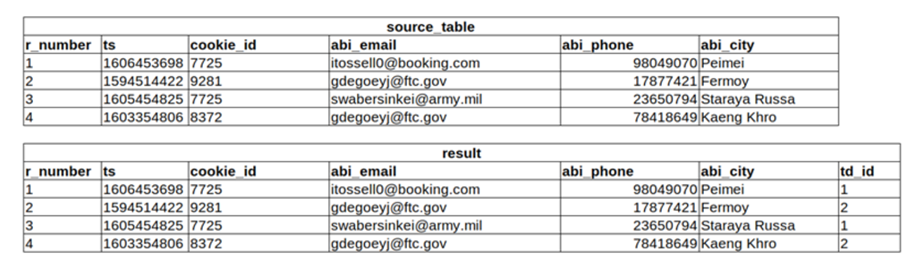

# Prueba_DE

## PRUEBA - DATA ENGINEER

La siguiente prueba tiene como finalidad medir sus capacidades en diferentes aspectos fundamentales para la inteligencia de negocios, tanto en idioma español como inglés.
Los aspectos que se  van a medir son los siguientes:

1.	**Capacidad Analítica**: Capacidad de transformar datos con el fin de poder responder preguntas de negocio por medio de tableros o reportes a la medida.
2.	**Capacidad de Programación**: Capacidad de representar mediante algoritmos soluciones frente a situaciones o requerimientos analíticos y poder transformarlos en diferentes lenguajes de programación.
3.	**Análisis Situacional**: Capacidad de Analizar diferentes situaciones organizacionales que tienen un grado de incertidumbre y requieren la administración oportuna del riesgo.
Le solicitamos que responda estas preguntas a conciencia y como a usted considere que puede ser la  manera de llegar a una solución efectiva y oportuna, dado que eventualmente se le pedirá que justifique sus respuestas. La prueba tendrá preguntas de respuesta abierta, querys SQL y opción múltiple.

## Preguntas - Análisis Situacional

1.	Una Empresa de Retail, que tiene aproximadamente 50.000 clientes registrados en sus bases de datos y unas ventas mensuales de aproximadamente $10 mil millones, la cual  realiza ventas tanto de manera presencial como en su comercio electrónico, debe presentar a la junta directiva cada mes todos los indicadores que muestren como van funcionando las áreas de la compañía, por eso hasta hace poco el área de TI enviaba una sábana de datos que sacan directamente desde el ERP a una secretaria de la parte administrativa que tiene muchos conocimientos en Excel que se encarga de sacar los datos y enviarlos a cada área para que saquen sus indicadores de gestión y luego ella poder consolidarlo en un Power Point para la gerencia. 
Actualmente dicha sabana de datos está quedando pequeña por la limitación que tiene Excel en la cantidad de filas  y se les solicito a TI enviar los datos resumidos según una estructura definida por la secretaria encargada de la consolidación; adicionalmente las áreas aprovechan esos datos enviados cada mes para tomar decisiones dentro del área, pero se están dando cuenta que dichas decisiones no están ajustadas a la realidad del negocio, ya que por las estrategias realizadas por mercadeo, los clientes se vienen incrementando al igual que las ventas, por eso las decisiones tomadas son tardías y no dan abasto con los pedidos hechos ya que el inventario se les agota muy rápido.

Tenga en cuenta las siguientes aclaraciones:
-	El ERP es una solución a la medida que por debajo tiene una base de datos DB2
-	La descarga de datos depende completamente de una persona de soporte y que tenga la disponibilidad para hacerlo, pero como el informe es para la junta directiva, deben hacerlo muy rápido, o sea que debe parar sus trabajo por un momento para realizar la descarga y luego poder continuar con su labor.
-	La compañía está interesada en contratar a una persona que tenga conocimientos analíticos que les pueda ayudar diseñando una solución más automática y costo eficiente.
-	Cada área es la encargada de moler los datos y sacar sus propias estadísticas e indicadores, por lo que les ha tocado buscar dentro de su personal a empleados que tengan conocimientos en Excel y gestión de indicadores.

Según la situación presentada, por favor responda las siguientes preguntas.

a.	¿Cómo explicaría la problemática actual de la compañía?

b.	¿Qué solución propone para el problema que enfrenta actualmente la compañía que permita tener un entorno analítico escalable y administrable? 

Debe detallar los siguientes elementos: 
a.	Arquitectura
b.	Infraestructura
c.	Solución a nivel de datos
d.	Visualización
c.	¿Qué metodología utilizaría para la construcción y validación de la solución?
d.	Represente de manera gráfica como sería la arquitectura de la solución.
e.	¿Qué tecnologías utilizaría para la construcción de dicha solución?

2.	Dadas las siguientes tablas de una base de datos, por favor construya las sentencias SQL que den respuestas a unas preguntas de negocio que se le plantean

### TABLA DE VENTAS
| Variable       | Tipo Variable |
|----------------|---------------|
| Id_cliente     | String        |
| Id_canal_venta | String        |
| Id_producto    | String        |
| Valor_venta    | Integer       |
| Valor_IVA      | Integer       |
| Fecha_venta    | Timestamp     |

### TABLA DE CLIENTES
| Variable    | Tipo Variable |
|-------------|---------------|
| Id_cliente  | String        |
| Nombre      | String        |
| Apellido    | String        |
| Ciudad      | String        |
| Genero      | String        |

### TABLA DE CANAL DE VENTA
| Variable          | Tipo Variable |
|-------------------|---------------|
| Id_canal_venta    | String        |
| Descripcion_canal | String        |

### TABLA DE PRODUCTOS
| Variable             | Tipo Variable |
|----------------------|---------------|
| Id_producto          | String        |
| Descripcion_producto | String        |
| Costo_producto       | Integer       |

a.	Realice una sentencia SQL que permita sacar el total de ventas por Canal de venta
b.	Realice una sentencia SQL que permita sacar el promedio de ventas por Genero
c.	Realice una sentencia SQL que permita saber el costo total por mes y por ciudad

3.	Una compañía de retail necesita definir desde febrero una solución para motivar a su equipo comercial a vender más durante el mes de marzo, teniendo en cuenta las siguientes reglas de negocio:
- La compensación por alcanzar las metas de ventas se dará en puntos redimibles por productos dentro de la compañía. Eso quiere decir que por cada x valor en punto debe cumplir con z valor en ventas, para redimir los puntos asignados.
- Si la comercial vendió más en marzo del año pasado que en febrero del presente año, entonces se le asignan los puntos de marzo del año pasado + 50 puntos adicionales.
- Si la comercial vendió más en febrero del presente año que en marzo del año pasado se le asignan los puntos de febrero + 100 puntos adicionales.
- Si la comercial no estuvo durante el mes de marzo, pero vendió en algunos de los meses del año anterior, entonces se debe promediar los puntos de las ventas del año anterior y asignarlos a la compensación de marzo del presente año.
- Incluya cualquier otra regla que sea necesaria para que la lógica de la asignación del modelo de compensación por puntos tenga sentido.

Según lo anterior, resuelva:

a. Una expresión en pseudocódigo o el lenguaje de su preferencia del algoritmo expresado en la lógica.
b. ¿Si tuviera que llevar este algoritmo a producción cómo lo haría?

### SQL - Capacidad Analítica

4.	Select the code which shows all abi_email which starts with 'john' or 'phillip'.
A	SELECT abi_email FROM usa_web_form WHERE abi_email LIKE 'john%' OR abi_email LIKE 'phillip%'
B	SELECT abi_email FROM usa_web_form WHERE abi_email LIKE 'john%' OR 'phillip%' 
C	SELECT abi_email FROM usa_web_form WHERE abi_email LIKE 'john%' AND abi_email LIKE 'phillip%' 
D	SELECT abi_email FROM usa_web_form WHERE abi_email LIKE 'john%' AND 'phillip%' 
E	SELECT abi_email FROM usa_web_form WHERE abi_email LIKE '%john' OR abi_email LIKE '%phillip

5.	Select the code that shows, in a single row, how many unique abi_email were obtained in td_host www.budweiser.com with abi_age between 21 and 34
A	SELECT COUNT(DISTINCT abi_email) FROM usa_web_form WHERE td_host = 'www.budweiser.com' AND abi_age BETWEEN 21 AND 34  
B	SELECT COUNT(DISTINCT abi_email) FROM usa_web_form WHERE td_host = 'www.budweiser.com' AND BETWEEN (21, 34) 
C	SELECT COUNT(abi_email) FROM usa_web_form WHERE td_host = 'www.budweiser.com' AND abi_age BETWEEN 21 AND 34 
D	SELECT DISTINCT abi_email FROM usa_web_form WHERE td_host = 'www.budweiser.com' AND abi_age BETWEEN (21, 34) 
E	SELECT abi_email FROM usa_web_form WHERE td_host = 'www.budweiser.com' AND abi_age BETWEEN (21, 34)

6.	What does the following SQL code retrieves? 
WITH tmp AS 
( SELECT abi_email 
FROM usa_ecommerce_customers 
WHERE abi_age >= 21 ) 
SELECT COUNT(DISTINCT abi_email) 
FROM usa_web_form 
WHERE abi_email IN (SELECT * FROM tmp)

A	Will return the amount of all unique abi_email from usa_web_form that can be found also in usa_ecommerce_customers and have abi_age 21 or higher in usa_ecommerce_customers  
B	Will return the amount of all unique abi_email from usa_web_form added with all abi_email from usa_ecommerce_customers and have abi_age 21 or higher  
C	Will return a list of all abi_email from usa_web_form that can be found also in usa_ecommerce_customers and have abi_age 21 or higher in usa_ecommerce_customers 
D	Will return a list of all abi_email from usa_web_form added with all abi_email from usa_ecommerce_customers and have abi_age 21 or higher

7.	Given the table usa_web_form and respective data content, what does the following SQL code retrieves?
 SELECT * 
FROM usa_web_form 
WHERE 
abi_first_name = 'John' AND
 abi_last_name = 'Doe' AND 
abi_last_name = 'Foo

 
A	Will not retrieve anything because some WHERE statements are conflicting  
B	Will retrieve 2 records. IDs 2, 3  
C	Will retrieve 1 record. ID 3
D	 Will retrieve all 4 records. IDs 1, 2, 3, 4

8.	Considering the tables below, please select the correct SQL statement that will retrieve the amount of unique visited_pages from each consumer identified by abi_email that have an entry in usa_web_form, by matching via cookie_id.
 

	SELECT COUNT(DISTINCT v.visited_page), f.abi_email FROM usa_web_form f JOIN usa_page_views v ON f.cookie_id = v.cookie_id GROUP BY f.abi_email  
	SELECT COUNT(DISTINCT v.visited_page), f.abi_email FROM usa_web_form f JOIN usa_page_views v ON f.cookie_id = v.cookie_id  
	SELECT COUNT(v.visited_page), f.abi_email FROM usa_web_form f JOIN usa_page_views v ON f.cookie_id = v.cookie_id GROUP BY f.abi_email 
	SELECT DISTINCT v.visited_page, f.abi_email FROM usa_web_form f JOIN usa_page_views v ON f.visited_page = v.visited_page 
	SELECT AMOUNT(DISTINCT v.visited_page), f.abi_email FROM usa_web_form f, usa_page_views v WHERE f.abi_email = v.abi_email

9.	Considering the table below, what SQL statement should be used to standardize the field abi_gender to 'M' for male, 'F' for female and 'O' for other?
 
 

A	SELECT cookie_id, timestamp, abi_email CASE WHEN lower(abi_gender) IN ('male', 'men') THEN 'M' WHEN lower(abi_gender) IN ('f', 'female', 'girl') THEN 'F' WHEN lower(abi_gender) IN ('other') THEN 'O' END AS abi_gender FROM usa_web_form  
B	SELECT cookie_id, timestamp, abi_email, NORMALIZE(abi_gender, 'M', 'F', 'O') FROM usa_web_form HAVING abi_gender in ('male', 'MEN', 'female', 'girl', 'other') 
C	SELECT cookie_id, timestamp, abi_email, NORMALIZE(abi_gender AS 'M' WHEN 'male' OR 'men', 'F' WHEN 'girl' OR 'female', 'O' WHEN 'other') FROM usa_web_form 
D	SELECT cookie_id, timestamp, abi_email, CASE abi_gender IN ('male', 'MEN', 'female', 'girl', 'other') THEN 'M', 'M', 'F', 'F', 'O' FROM usa_web_form

10.	Unification Test 
This test have been built around a dummy scenario related to consumer unification and have description as it follows: 
BUSINESS RULES 
After the consumer data is captured, the records go through an unification process, which assign the same ID for the same consumer. 
The assigned ID is called td_id and for the same identified consumer, the same td_id is assigned. For this scenario, the column r_number (row number) have to be used as td_id. 
To identify the same consumer across multiple rows of data, we use different columns that are considered consumer IDs. For this scenario, we will consider the following columns as consumer IDs:

A	cookie_id 

B	abi_email 

C	abi_phone 

Considering above, we want you to work with the source_table table. 
Example (please check the image below): 

A.	Despite of having 4 consumer records in the source_table, after the unification process they were identified as ony 2 different consumers, because the r_number 1 and 3 shared the same cookie_id and r_number 2 and 4 shared the same abi_email. 

B.	The table after the unification process, should be like the result table below (the one with td_id in last column).

 

Go to https://sqliteonline.com/ and use the DDL below to create the environment for your test: 
CREATE TABLE source_table ( r_number integer, ts varchar, cookie_id varchar, abi_email varchar, abi_phone varchar, abi_city varchar ); 
INSERT INTO source_table (r_number, ts, cookie_id, abi_email, abi_phone, abi_city) VALUES (1, '1605994889', '6820', 'sbreffitt0@printfriendly.com', '94205507', 'Goz Beida'); INSERT INTO source_table (r_number, ts, cookie_id, abi_email, abi_phone, abi_city) VALUES (2, '1604213383', '9919', 'ptrouncer1@cpanel.net', '25598134', 'Umea'); INSERT INTO source_table (r_number, ts, cookie_id, abi_email, abi_phone, abi_city) VALUES (3, '1609605142', '3478', 'gspearett2@foxnews.com', '93216475', 'Le Teil'); INSERT INTO source_table (r_number, ts, cookie_id, abi_email, abi_phone, abi_city) VALUES (4, '1622330810', '5982', 'gspearett2@foxnews.com', '28674053', 'Yima'); INSERT INTO source_table (r_number, ts, cookie_id, abi_email, abi_phone, abi_city) VALUES (5, '1613878252', '6820', 'rsidwick4@webeden.co.uk', '70204814', 'Otyn'); INSERT INTO source_table (r_number, ts, cookie_id, abi_email, abi_phone, abi_city) VALUES (6, '1616830525', '5922', 'llinguard5@t.co', '25598134', 'Kota Kinabalu'); INSERT INTO source_table (r_number, ts, cookie_id, abi_email, abi_phone, abi_city) VALUES (7, '1610543967', '2653', 'aarchard6@topsy.com', '68320893', 'Pego Longo'); INSERT INTO source_table (r_number, ts, cookie_id, abi_email, abi_phone, abi_city) VALUES (8, '1615444814', '8785', 'dhatliff7@sakura.ne.jp', '25598134', 'Imam Sahib'); INSERT INTO source_table (r_number, ts, cookie_id, abi_email, abi_phone, abi_city) VALUES (9, '1615024464', '5688', 'gspearett2@foxnews.com', '72392351', 'Ramotswa'); INSERT INTO source_table (r_number, ts, cookie_id, abi_email, abi_phone, abi_city) VALUES (10, '1623898817', '6820', 'ipittf@cnn.com', '57919992', 'Limeiras');
Using the same table source_table created, create a SQL SELECT statement that will assign the smallest same r_number in the column td_id for all consumers that share any of the consumer ids described in BUSINESS RULES above. 
The result should have the same structure as the table result in screenshot above, but with proper processing of all 10 rows loaded previously. TIP: You can check your results manually before submitting the test
R:

11.	Consent Test. This test have been built a dummy scenario around consumer consents and have the description as it follows: 
BUSINESS RULES 

Before using any consumer data, we need their consent for Terms & Conditions (TC-PP) and Marketing Activation (MARKETING-ACTIVATION) for each brand. 

For each consent accepted, our table will receive one row, with an id for the consumer, a brand to which this consent was collected and the consent itself. 

Considering this, we want you to work with the consent table data (abi_consents), according to these BUSINESS RULES:

1. The consumer consent will be classified as Opted-In if she/he accepted both Terms & Conditions and Marketing Activation. 

2. The consumer consent will be classified as Not Given if she/he accepted only Terms & Conditions 

3. For any other case, the consumer consent will be classified as Unknown. 

**Example:**

if the table contains a row with TC-PP and another row with MARKETING-ACTIVATION for a specific consumer and specific brand, the consumer consent have to be classified as "OptedIn" for that brand. 
If the table contains only a row with TC-PP for a specific consumer and brand, the consent have to be classified as "Not Given".

Using the same table abi_consents, create a query to process the input table according to the BUSINESS RULES described in the section description above. 

The output for your query should be a resultset containing the consumer id, the brand and the consent classification according to example screenshot below. 

Please write you query in the open field below
 

Go to https://sqliteonline.com/ and use the DDL below to create the environment for your exercise: 

CREATE TABLE abi_consents ( client_id VARCHAR(4), brand_name VARCHAR(15), consent VARCHAR(20) ); INSERT INTO abi_consents VALUES ('AF32', 'BRAHMA', 'TC-PP'); INSERT INTO abi_consents VALUES ('AF32', 'BRAHMA', 'MARKETINGACTIVATION'); INSERT INTO abi_consents VALUES ('YD71', 'BRAHMA', 'TC-PP'); INSERT INTO abi_consents VALUES ('ODA2', 'BRAHMA', null); INSERT INTO abi_consents VALUES ('LA94', 'BRAHMA', 'MARKETINGACTIVATION'); INSERT INTO abi_consents VALUES ('JA13', 'BRAHMA', 'MARKETING-ANALYTICS'); INSERT INTO abi_consents VALUES ('JA13', 'BRAHMA', 'TC-PP'); INSERT INTO abi_consents VALUES ('YD71', 'SKOL', 'TC-PP'); INSERT INTO abi_consents VALUES ('YD71', 'SKOL', 'MARKETING-ACTIVATION'); INSERT INTO abi_consents VALUES ('KD81', 'SKOL', 'TC-PP'); INSERT INTO abi_consents VALUES ('KD81', 'SKOL', 'MARKETING-ACTIVATION'); INSERT INTO abi_consents VALUES ('OSW1', 'BRAHMA', 'TC-PP'); INSERT INTO abi_consents VALUES ('KD81', 'SKOL', null);

### Python y SQL  - Capacidad de Programación (Realice solamente dos - Libre elección):

12.	Programación Orientada a Objetos: Diseñe una clase vehículo, el cual tenga 4 variables: una para el color del vehículo, marca del vehículo, cantidad de llantas y velocidad del vehículo, esta clase debe contar con los métodos que retornan y modifican estos valores, es decir que en la ejecución del programa se pueda:

-	Saber a qué velocidad va un objeto tipo vehículo.
-	Poder reducir o aumentar este valor.
-	El programa debe aceptar vehículos de dos (Motos) o cuatro ruedas (Carros).

Si ve necesario implementar clases abstractas puede implementarlas.
Adjunte la respuesta en un notebook en colab. Comparta el link de forma pública 

13.	Datos anidados: Cree una cuenta gratuita en Google Cloud y seguir el siguiente tutorial para destacar los datos públicos en bigquery (bigquery-public-data) para la prueba
Utilizando la siguiente base de datos: 
ruta: bigquery-public-data.ga4_obfuscated_sample_ecommerce.events_20210131 
Se debe construir la siguiente tabla final:
 
La base de datos para el ejercicio tiene un estructura anidada cómo la siguiente:

 

Por lo que deberá desanidar los campos, comprimir los valores de event_params.value.(string_value, int_value, etc) y pivotear algunos campos para crear la tabla final. 
Adjunte la query que logra esa tabla 

14.	Conexión API Facebook 
Basado en el siguiente colab: Ejercicio API Facebook.ipynb
Ejecute el código para instalar el sdk de python y autentificar la api con la cuenta de prueba. Luego desarrollo un codigo que permita dado la siguiente base de datos (Prueba API Facebook):
-	Crear cada una de las campañas (recorra la base de datos con un ciclo y la función create_campaign() cree cada uno de las campañas con sus campos respectivos: campaign_name, buying_type campaign, objective campaign , status campaign)
-	Por cada campaña cree cada uno de los adsets (recorra la base de datos con un ciclo y la función create_ad_set() cree cada uno de los adsets para cada campaña con sus campos respectivos: adset_name, daily_budget adset,optimization_goal, status adset)
-	Por último, cada vez que cree la campañas y sus adset obtenga de nuevo cada una de las campañas y sus adset creados con todos su campos la función api_get () y añadalos a un dataframe
-	Por medio de api_get obtenga el nombre de la Ad Account 
La documentación de apoyo la puede encontrar en los siguientes links: 
https://developers.facebook.com/ds<AAocs/marketing-apis/get-started
https://developers.facebook.com/docs/marketing-api/reference/ad-account/insights
https://github.com/facebook/facebook-python-business-sdk
Tip: revisar la carpeta examples de la documentación en git
Adjunte la respuesta en un notebook en colab. Comparta el link de forma pública 
